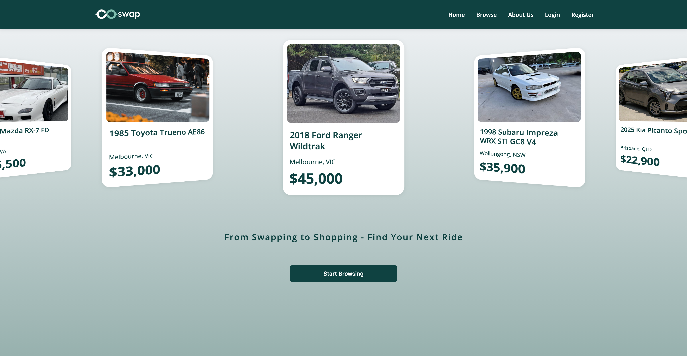
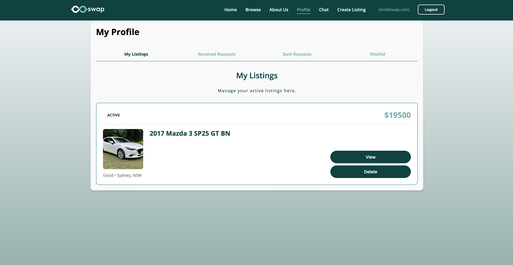
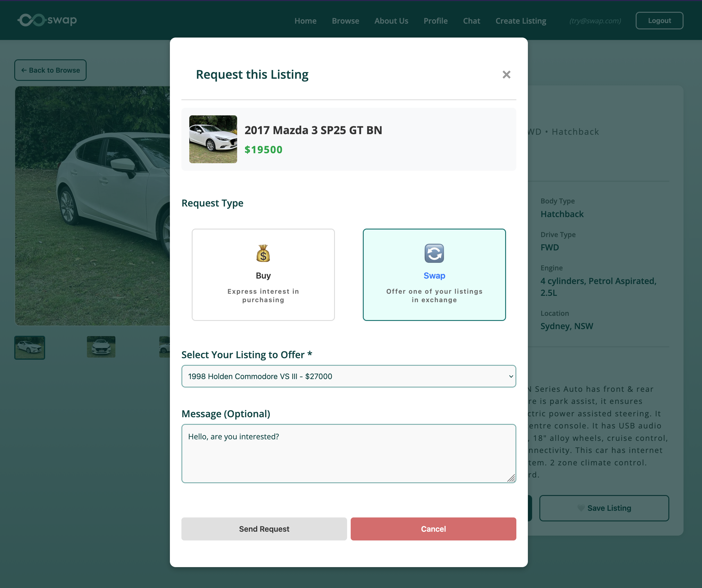
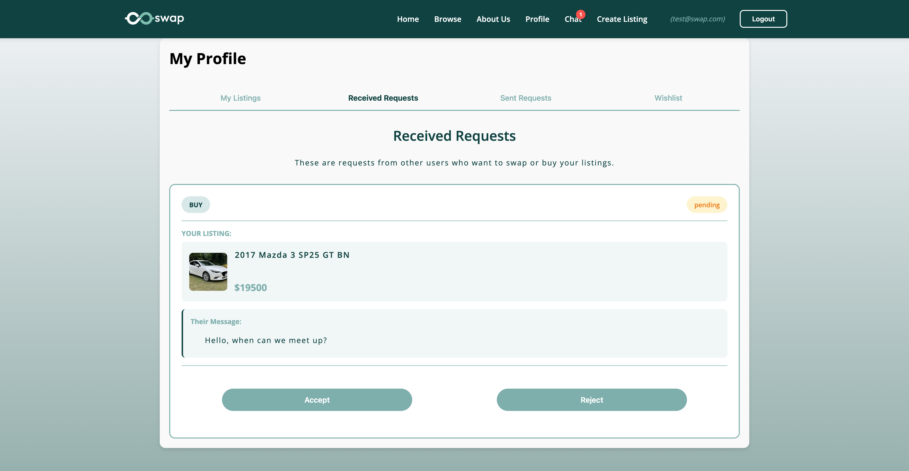
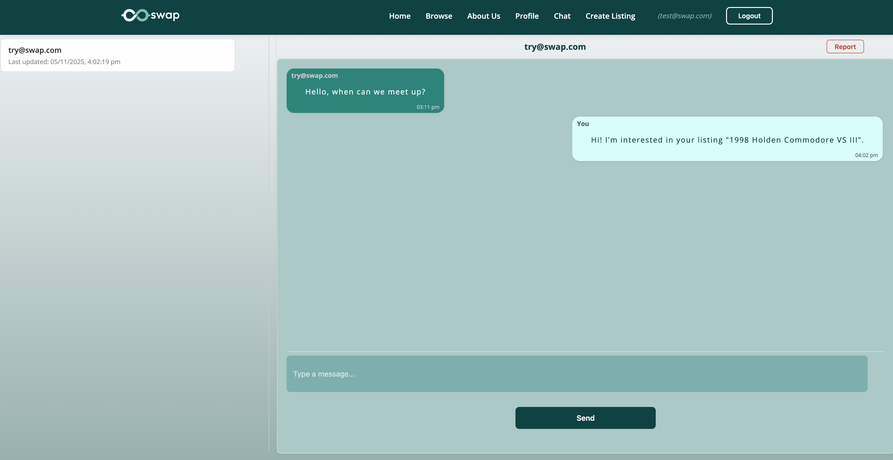

# Swap – Vehicle Marketplace Platform

Swap is a full-stack marketplace platform that allows users to **buy, sell, or directly swap vehicles** with other users.

Unlike traditional marketplaces that only support monetary transactions, Swap introduces a **trade system** where users can propose vehicle exchanges and negotiate directly within the platform.

Live Website [here](https://swap-frontend-tigr.onrender.com/)

# Features

### Vehicle Listings
Users can create listings for vehicles they want to sell or trade.

Listings include:
- vehicle details
- description
- price
- images
- owner information

---

### Marketplace Browsing
Users can browse all available listings and filter results to find vehicles that match their preferences.

Features include:
- dynamic filtering
- listing cards with vehicle previews
- listing detail pages

---

### Swap Request System
One of the core features of the platform is the **vehicle swap system**.

Users can propose trades by offering one of their own vehicles in exchange for another listing.

Swap requests include:
- the offered vehicle
- optional message
- request status tracking

Statuses include:
- pending
- accepted
- declined

---

### User Profiles
Each user has a profile page that displays:

- their listings
- sent offers
- incoming offers
- saved listings

---

### Communication & Notifications
The platform provides notifications and communication between users:

- Real-time messaging system between users
- Exchange of contact information
- Notification system for new messages, incoming offers, and offer status updates (accepted/declined)

---

# Tech Stack

Frontend
- React
- JavaScript
- HTML / CSS

Backend
- Node.js
- Express

Infrastructure
- Firebase Authentication
- Firestore database
- Cloudinary (image hosting)

Deployment
- Render

---

# My Contributions

This project was developed as part of a team.

My main contributions included:

- Firestore database schema and security rules
- Browse page and dynamic listing filters
- Create listing workflow
- Listing detail pages
- Profile page
- Swap request modal and offer management
- Notification system

---

# Screenshots

## Home Page

---

## Vehicle Listing Page

---

## User Profile

---

## Swap Request Interface

---

## Offer Interface 

---

## Message Thread

---

# Running the Project

To run the project locally:
    npm install
    npm run dev

Note: Environment variables and service credentials are not included in this repository.

---

# Notes

This repository contains a cleaned version of the project prepared for portfolio purposes.

